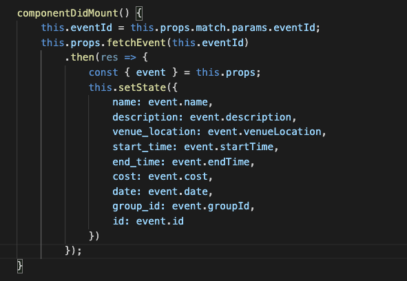

# FeetUp

Live: http://feetup.herokuapp.com/

FeetUp is a single page web-app clone of the pre-existing Meetup. Both apps provide users with group joining and event hosting capabilities. The site is hosted and functional on heroku.

# Technologies

* Backend: Rails/ActiveRecord/PostgresSQL
* Frontend: React/Redux
* SCSS Styling
* FontAwesome
* AWS/Active Storage for Images

# Features

## Users

* Visitors to the site have the ability to sign up or login using their email as well as password encryption authentication. 
* Members can join or leave groups. Through groups members can also rsvp to sponsored events.
* User's profile page displays their provided information and shows all groups they are a part of.

## Groups

* On login all a user's groups are displayed, as well as all groups a user can potentially join. 
* Each group item is clickable and brings the user to the show page for the respective group. Here a user can join or leave the group, thus creating or deleting a membership. 

## Events

* A group can host events that their members can sign up for via an RSVP. 
* After signing up, users can also change their mind and cancel their RSVP.

# Technical Challenges

* Because each group, user, and event at some point needs to know the state of their other associated models, it makes designing the backend data being sent tricky. Lots of finessing of reducers and jbuilder data queries were required. One of the more interesting aspects for me, was the creation of custom controller actions and respective routes for the membership and rsvp joins tables. 

* The above code handles some of the nuances of the event edit form. On refresh the component errored out as the event no longer was found in state. This fetches the event and uses a promise to wait for it to be loaded before assigning the event attributes to state. Additionally it destructures the event from props to make the code more legible.

# Future Work to be Done

## General

* Add search functionaility for both groups and events based on tags and location.

## Groups

* Add full C.R.U.D. functionality to allow users to create and update groups, rather than just sign up or leave a pre-existing one. 
* Add subject tags to groups to allow users to search for groups based on interests.

## Events

* Add full C.R.U.D. functionality to allow users to create and update events (specifically only events for groups they are a part of), rather than just sign up or leave a pre-existing one.